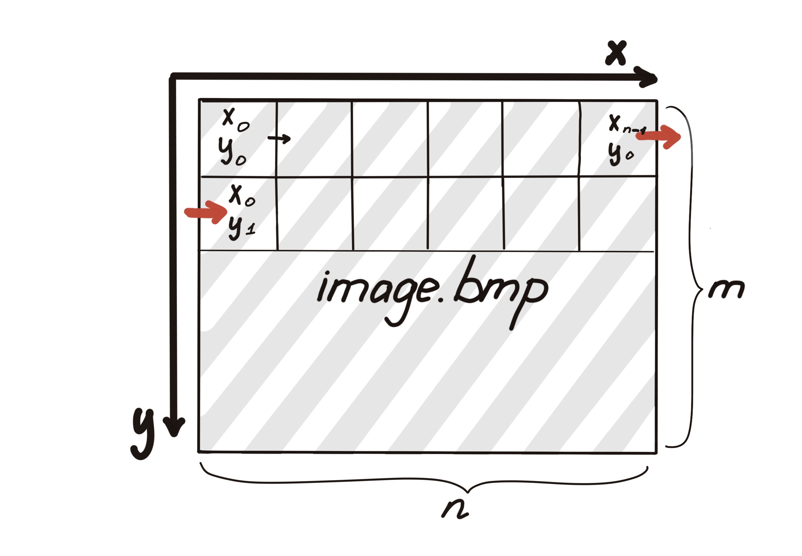

# Задача 5

Разработать две консольные утилиты: для конвертации BMP изображений в негатив и для попиксельного сравнения двух BMP изображений.

## Общие требования

- Написать библиотеку `bmp`, которая будет состоять из необходимых для реализации утилит функций по работе с BMP изображениями (например, чтение, запись и тд), и на основе этой библиотеки сделать две утилиты: `converter` и `comparer`.
    - Должны поддерживаться два формата BMP: 8bit и 24bit.
    - Должен поддерживаться **только** `BITMAPINFOHEADER` с размером header’а 40 байтов, сжатие поддерживать не надо.
- Валидировать пользовательский ввод на предмет отсутствующих, лишних, или неверных аргументов.
В случае ошибки вывести внятное и осмысленное сообщение в стандартный поток ошибок.
- Отладить программу с помощью Address Sanitizer и/или Valgrind/Memcheck, решить проблемы работы с указателями и памятью.

## Converter

Утилита считывает изображение из файла, конвертирует его в негатив и записывает в другой файл.
Преобразование 8bit изображений осуществляется путем инвертирования таблицы цветов, 24bit изображений – путем попиксельного инвертирования.
Пути до входного и выходного файла передаются через аргументы командной строки.

```sh
converter input.bmp output.bmp
```

### Коды возврата:

- `0` — изображение успешно сконвертировано.
- `1` — некорректные аргументы командной строки, неподдерживаемый формат, ошибки, которые относятся к структуре изображения и иные ошибки.
Также необходимо вывести внятное сообщение о случившейся ошибке в стандартный поток ошибок.
- Других кодов возврата быть не должно.

## Comparer

Утилита считывает два изображения из файлов и производит попиксельное сравнение.
Пути до файлов передаются через аргументы командной строки.

- Если изображения попиксельно совпадают (**Код возврата:** `0`), вывести сообщение `Images are same` в стандартный поток вывода.
- Если изображения различны (**Код возврата:** `2`), вывести в стандартный поток ошибок координаты первых 100 различающихся пикселей в следующем формате:
  - Вывести сообщение `"Next pixels are different:\n"`
  - Выводить пиксели в формате: `"x%-6d y%-6d\n"`
  - Считаем за начало координат левый верхний угол.
  - Если картинка n в ширину и m в высоту, то выводим (координаты не могут быть отрицательными и растут лишь в плюс, не обращайте внимания, что ось OY направлена вниз):

<p align="center">
   </br>
  X₀ Y₀ </br>
  X₁ Y₀ </br>
   … </br>
  Xₙ₋₁ Y₀ </br>
  Xₙ  Y₀ </br>
  X₀ Y₁ </br>
  X₁ Y₁ </br>
  … </br>
</p>

- Если сравнение невозможно в принципе (**Код возврата:** `1`), например, не совпадают длины или высоты, не совпадают форматы и т.д., вывести внятное сообщение о проблеме в стандартный поток ошибок.

Специальные случаи:
- Изображения, отличающиеся лишь порядком хранения пикселей, считаются совпадающими.
- Изображения, отличающиеся лишь способом хранения цвета пикселей, считаются совпадающими.
- Изображения разной битности всегда считаем несовпадающими.

Использование имеет следующий вид, вызов через командную строку:

```sh
comparer image1.bmp image2.bmp
```
### Коды возврата:

- `0` — изображения совпадают.
- `1` — некорректные аргументы командной строки, изображения несравнимы, неподдерживаемый формат, ошибки, которые относятся к структуре изображения и иные ошибки.
Также необходимо вывести внятное сообщение о случившейся ошибке в стандартный поток ошибок.
- `2` — изображения не совпадают.
- Других кодов возврата быть не должно.

## Работа с GitHub:
- [Ссылка на тестирующую систему](https://github.com/spbu-coding-2024/5-grading-system)
